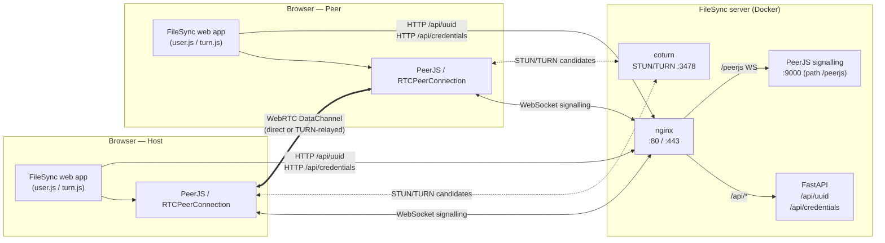

# Peer Connection Establishment

This document describes how a peer-to-peer connection is established between
two FileSync clients (a **Host** and a **Peer**).

FileSync uses [PeerJS](https://peerjs.com/) — a thin wrapper around the browser
[WebRTC](https://developer.mozilla.org/en-US/docs/Web/API/WebRTC_API) APIs.
The signalling channel is a PeerJS server reachable at `/peerjs`, NAT
traversal is handled by a `coturn` STUN/TURN server on port `3478`, and a
small FastAPI service issues short-lived TURN credentials.

## High-level architecture



## Sequence: Host creates a room, Peer joins

```mermaid
sequenceDiagram
    autonumber
    participant H as Host browser
    participant P as Peer browser
    participant N as nginx
    participant API as FastAPI (/api)
    participant S as PeerJS signalling
    participant T as coturn (STUN/TURN)

    Note over H: User opens "/" (no room id)<br/>Host generates a room_id<br/>and uses it as its peer id

    H->>N: GET /api/uuid
    N->>API: proxy
    API-->>H: { uuid }
    H->>N: GET /api/credentials
    N->>API: proxy
    API-->>H: { token } (JWT with TURN user/cred, TTL 5 min)
    Note over H: turn.getServers() builds<br/>iceServers = [stun:..:3478, turn:..:3478 +creds]

    H->>N: WS upgrade /peerjs
    N->>S: proxy WebSocket
    S-->>H: open (peer registered as room_id)
    Note over H: peer.on('open') resolves;<br/>peer.on('connection', ...) waits for joiners

    Note over P: User opens "/<room_id>"<br/>(URL pathname == host's peer id)

    P->>N: GET /api/uuid
    API-->>P: { uuid }
    P->>N: GET /api/credentials
    API-->>P: { token }

    P->>N: WS upgrade /peerjs
    N->>S: proxy WebSocket
    S-->>P: open (peer registered with own uuid)

    Note over P: user.connect(room_id)<br/>→ peer.connect(room_id)

    P->>S: SDP offer + ICE candidates (signalling)
    S->>H: SDP offer + ICE candidates
    H->>S: SDP answer + ICE candidates
    S->>P: SDP answer + ICE candidates

    par ICE gathering on both sides
        H->>T: STUN binding / TURN allocate
        T-->>H: server-reflexive / relay candidates
    and
        P->>T: STUN binding / TURN allocate
        T-->>P: server-reflexive / relay candidates
    end

    H<<-->>P: ICE connectivity checks (host / srflx / relay)
    Note over H,P: WebRTC DataChannel becomes "open"<br/>(direct P2P if possible, else TURN-relayed)

    P->>H: { "webrtc-connect": { name [, password (sha-256)] } }

    alt Host requires a password and none/wrong was sent
        H-->>P: { "webrtc-connect-response": { status: "password_required" | "password_invalid" } }
        Note over P: UI prompts for password,<br/>peer.connect() retried with hashed password
    else Credentials accepted
        H-->>P: { "webrtc-connect-response": { status: "welcome", secured } }
        H-->>P: { "webrtc-peers": [...], "webrtc-files": [...] }
        Note over H,P: Connection ready —<br/>file sharing can begin
    end
```

## Code references

| Step | Where it happens |
| --- | --- |
| Decide host vs. peer based on URL | `web/js/modules/script.js:5`, `web/js/modules/script.js:46` |
| Fetch peer UUID from API | `web/js/modules/webrtc/user.js:1006` |
| Fetch TURN credentials (JWT) | `web/js/modules/webrtc/turn.js:20` |
| Build `iceServers` (STUN + TURN) | `web/js/modules/webrtc/turn.js:6` |
| Create `Peer` and connect to signalling server | `web/js/modules/webrtc/user.js:74` |
| Host listens for incoming connections | `web/js/modules/webrtc/user.js:98` |
| Peer initiates `peer.connect(room_id)` | `web/js/modules/webrtc/user.js:108` |
| DataChannel open → send `webrtc-connect` (name + hashed password) | `web/js/modules/webrtc/user.js:559` |
| Host validates and replies `welcome` / `password_required` / `password_invalid` | `web/js/modules/webrtc/user.js:593` |
| Peer reacts to `webrtc-connect-response` | `web/js/modules/webrtc/user.js:623` |
| Issue TURN credentials (HMAC-SHA1, JWT-wrapped) | `api/main.py:43` |
| nginx routes `/api/*` and `/peerjs` (WebSocket) | `nginx.conf:9`, `nginx.conf:18` |
| coturn / PeerJS / FileSync containers | `deploy/docker-compose.yml` |

## Notes

- The **room id** generated by the host (e.g. `abc-defgh-ij`) doubles as the
  host's PeerJS **peer id**. A joiner's URL path is exactly that peer id, so
  `peer.connect(room_id)` is enough to reach the host through the signalling
  server.
- TURN credentials are short-lived (TTL = 300 s, see `api/main.py:46`). The
  JWT is decoded client-side to extract the username/credential pair handed
  to `RTCPeerConnection`; the JWT itself is never sent to coturn.
- If direct P2P fails (symmetric NAT, restrictive firewalls), ICE will fall
  back to a TURN-relayed candidate via coturn on `:3478`. Forcing relay is
  possible by uncommenting `iceTransportPolicy: "relay"` in
  `web/js/modules/webrtc/user.js:83`.
- The application-level handshake (`webrtc-connect` / `webrtc-connect-response`)
  runs **on top of** the WebRTC data channel and is what gates room
  membership (including password protection).
